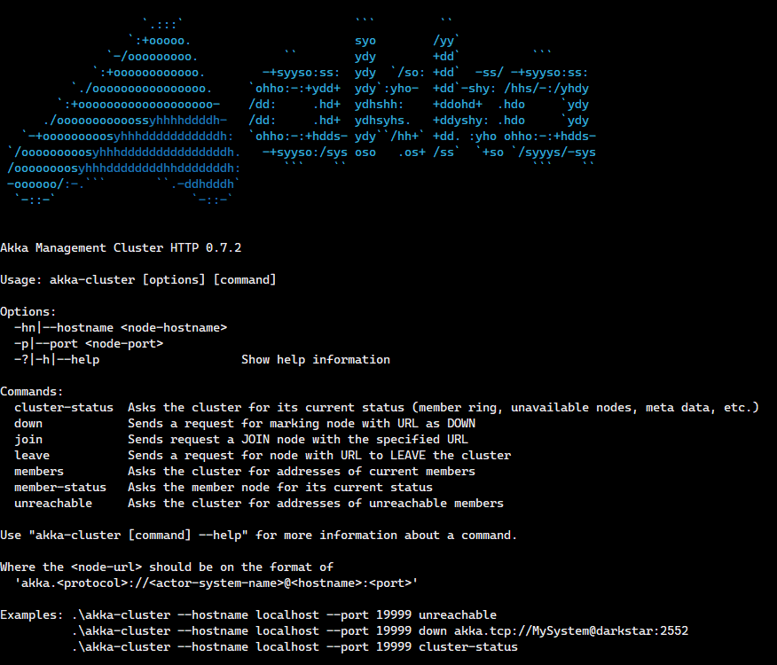

# Akka Management Cluster HTTP

Akka.NET Management Cluster HTTP, a port of the popular Java/Scala [library](https://github.com/akka/akka-management) to .NET, is a management extension that allows you interaction with an `akka-cluster` through an HTTP interface. This management extension exposes different operations to manage nodes in a cluster.

The operations exposed comparable to the JMX interface `akka-cluster` provides.



## API Definition

The following table describes the usage of the API:

| Path | HTTP method | Required form fields | Description 
| ------------- | ------------- | ------------- | ------------- 
| `/cluster/members/`  | GET | None | Returns the status of the Cluster in JSON format.
| `/cluster/members/` | GET | address: `{address}` | Returns the status of `{address}` in the Cluster
| `/cluster/members/`  | POST | address: `{address}` | Executes join operation in cluster for the provided `{address}`. 
| `/cluster/members/`  | PUT | address: `{address}`, operation: `down` | Executes down operation in cluster for provided `{address}`. 
| `/cluster/members/`  | PUT | address: `{address}`, operation: `leave` | Executes leave operation in cluster for provided `{address}`. 
| `/cluster/shards/{name}` | GET | None | Returns shard info for the shard region with the provided `{name}`

The expected format of address follows the Cluster URI convention. Example: `akka://Main@myhostname.com:3311`

#### GET /cluster/members responses

| Response code | Description
| ------------- | -----------
| 200           | Status of cluster in JSON format
| 500           | Something went wrong. Cluster might be shutdown.

Example response:

```
{
  "selfNode": "akka.tcp://test@10.10.10.10:1111",
  "members": [
    {
      "node": "akka.tcp://test@10.10.10.10:1111",
      "nodeUid": "1116964444",
      "status": "Up",
      "roles": []
    }
  ],
  "unreachable": [],
  "leader: "akka.tcp://test@10.10.10.10:1111",
  "oldest: "akka.tcp://test@10.10.10.10:1111"
}
```

#### GET /cluster/members/?address=\{address\} responses

| Response code | Description
| ------------- | -----------
| 200           | Status of cluster in JSON format
| 404           | No member was found in the cluster for the given `{address}`.
| 500           | Something went wrong. Cluster might be shutdown.

Example response:

```
{
  "node": "akka.tcp://test@10.10.10.10:1111",
  "nodeUid": "-169203556",
  "status": "Up",
  "roles": []
}
```

#### POST /cluster/members/ responses

| Response code | Description
| ------------- | -----------
| 200           | Executing join operation.
| 500           | Something went wrong. Cluster might be shutdown.

Example response:

```
Joining akka.tcp://test@10.10.10.10:111
```

#### PUT /cluster/members/ responses

| Response code | Operation | Description
| ------------- | --------- | -----------
| 200           | Down      | Executing down operation.
| 200           | Leave     | Executing leave operation.
| 400           |           | Operation supplied in `operation` form field is not supported.
| 404           |           | No member was found in the cluster for the given `{address}`
| 500           |           | Something went wrong. Cluster might be shutdown.

Example response:

```
Downing akka.tcp://test@10.10.10.10:111
```


#### GET /cluster/shards/\{name\} responses

| Response code | Description
| ------------- | -----------
| 200           | Shard region information in JSON format
| 404           | No shard region was found on the node for the given `{name}`

Example response:

```
{
  "regions": [
    {
      "shardId": "1234",
      "numEntities": 30
    }
  ]
}
```